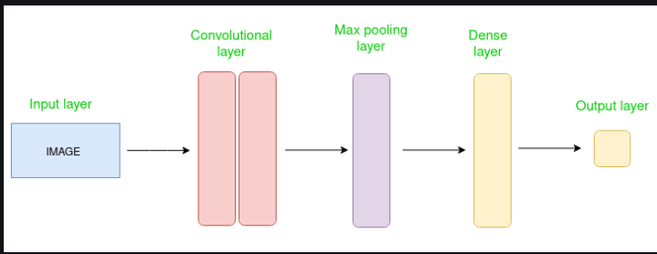
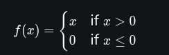

# Deep Learning and Neural Network

## Neural Networks

A neural network is a method in artificial intelligence (AI) that teaches computers to process data in a way that is inspired by the human brain. It is a type of machine learning (ML) process, called deep learning, that uses interconnected nodes or neurons in a layered structure that resembles the human brain. It creates an adaptive system that computers use to learn from their mistakes and improve continuously. Thus, artificial neural networks attempt to solve complicated problems, like summarizing documents or recognizing faces, with greater accuracy.

Machine learning is often applied in areas such as retail, e-commerce, transportation, logistics and healthcare. Neural networks are typically used for forecasting, research, risk management, and speech and text recognition.

### Gradient Descent

 is **an optimization algorithm for finding a local minimum of a differentiable function**. Gradient descent in machine learning is simply used to find the values of a function's parameters (coefficients) that minimize a cost function as far as possible.

### **Backpropagation**

Backpropagation, short for "backward propagation of errors," is an algorithm for supervised learning of artificial neural networks using gradient descent. Given an artificial neural network and an error function, the method calculates the gradient of the error function with respect to the neural network's weights.

### Gradient clipping

Gradient clipping is a vital technique in the training of deep neural networks, especially in architectures where the exploding gradient problem is a significant concern. By ensuring that the gradients remain within reasonable bounds, it helps maintain the stability and convergence of the training process. As with many techniques in deep learning, it requires careful tuning and consideration of the network's architecture and the specific learning task at hand.

### Gradient checkpointing

**Gradient Checkpointing** is a method used for reducing the memory footprint when training deep neural networks, at the cost of having a small increase in computation time.

### Gradient accumulation

Gradient accumulation is a way to virtually increase the batch size during training, which is very useful when the available GPU memory is insufficient to accommodate the desired batch size. In gradient accumulation, gradients are computed for smaller batches and accumulated (usually summed or averaged) over multiple iterations instead of updating the model weights after every batch. Once the accumulated gradients reach the target “virtual” batch size, the model weights are updated with the accumulated gradients.

## **Convolutional Neural Network (CNN)**

A Convolutional Neural Network (CNN) is a type of Deep Learning neural network architecture commonly used in Computer Vision. Computer vision is a field of Artificial Intelligence that enables a computer to understand and interpret the image or visual data.

The Convolutional layer applies filters to the input image to extract features, **the Pooling layer** downsamples the image to reduce computation, and the **fully connected layer** makes the final prediction. The network learns the optimal filters through backpropagation and gradient descent.

## ***Recurrent Neural Networks (RNNs)***

A recurrent neural network or RNN is a deep neural network trained on sequential or time series data to create a machine learning (ML) model that can make sequential predictions or conclusions based on sequential inputs.

Like traditional neural networks, such as feedforward neural networks and convolutional neural networks (CNNs), recurrent neural networks use training data to learn. They are distinguished by their “memory” as they take information from prior inputs to influence the current input and output. While traditional deep learning networks assume that inputs and outputs are independent of each other, the output of recurrent neural networks depend on the prior elements within the sequence. While future events would also be helpful in determining the output of a given sequence, unidirectional recurrent neural networks cannot account for these events in their predictions.

### LSTM

**Long Short-Term Memory** is an improved version of recurrent neural network designed by Hochreiter & Schmidhuber.A traditional RNN has a single hidden state that is passed through time, which can make it difficult for the network to learn long-term dependencies. LSTMs model address this problem by introducing **a memory cell**, which is a container that can hold information for an extended period. LSTM architectures are capable of learning long-term dependencies in sequential data, which makes them well-suited for tasks such as language translation, speech recognition, and time series forecasting. 

## **Generative Adversarial Network (GAN)**

GANs are a class of neural networks that autonomously learn patterns in the input data to generate new examples resembling the original dataset.

GAN’s architecture consists of two neural networks:

1. **Generator**: creates synthetic data from random noise to produce data so realistic that the discriminator cannot distinguish it from real data.
2. **Discriminator**: acts as a critic, evaluating whether the data it receives is real or fake.

They use adversarial training to produce artificial data that is identical to actual data.

The two networks engage in a continuous game of cat and mouse: the Generator improves its ability to create realistic data, while the Discriminator becomes better at detecting fakes. Over time, this adversarial process leads to the generation of highly realistic and high-quality data.

### GAN mode collapse

Modal collapse in GANs (Generative Adversarial Networks) occurs when the generator model produces a limited set of outputs that fail to capture the full diversity of the real data distribution. In other words, the generator starts producing similar or identical samples, leading to a collapse in the modes of the data distribution. This can happen when the discriminator becomes too strong, such that the generator fails to produce diverse samples that can fool the discriminator.

Modal collapse is a significant problem in GANs because it leads to a loss of diversity in the generated samples, which can render the GAN useless for many applications. There are several strategies to address modal collapse in GANs, including:

- Increasing the capacity of the generator or discriminator model.
- Adjusting the learning rate or optimization algorithm.
- Using regularization techniques such as weight decay or dropout to prevent overfitting.
- Incorporating diversity-promoting techniques such as diversity regularization or adding noise to the input or output of the generator.
- Using alternative GAN architectures that are less prone to mode collapse, such as Wasserstein GANs or InfoGANs.

## Feed-forward networks

A Feedforward Neural Network (FNN) is a type of artificial neural network where connections between the nodes do not form cycles. This characteristic differentiates it from recurrent neural networks (RNNs). The network consists of an input layer, one or more hidden layers, and an output layer. Information flows in one direction—from input to output—hence the name "feedforward.”

## **Vanishing or exploding gradients**

### Vanishing gradients

During backpropagation, the gradients frequently become SMALLER until they are close to zero, the new model weights (of the initial layers) will be virtually identical to the old weights without any updates. As a result, the gradient descent algorithm never converges to the optimal solution. This is known as the problem of vanishing gradients, and it’s one example of unstable behaviors of neural nets. 

Simply put, the vanishing gradients issue occurs when we use the Sigmoid or Tanh activation functions in the hidden layer; these functions squish a large input space into a small space. 

### Exploding gradients

On the contrary, if the gradients get LARGER or even NaN as our backpropagation progresses, we would end up with exploding gradients having big weight updates, leading to the divergence of the gradient descent algorithm.

Moving on to the exploding gradients, in a nutshell, this problem is due to the initial weights assigned to the neural nets creating large losses. Big gradient values can accumulate to the point where large parameter updates are observed, causing gradient descents to oscillate without coming to global minima. 

## **Activation functions**

An activation function is a mathematical function applied to the output of a neuron. It introduces **non-linearity** into the model, allowing the network to learn and represent complex patterns in the data. Without this non-linearity feature, a neural network would behave like a linear regression model, no matter how many layers it has. 

### ReLU

**The Rectified Linear Unit (ReLU)** is one of the most popular activation functions used in neural networks, especially in deep learning models. It has become the default choice in many architectures due to its simplicity and efficiency. The ReLU function is a piecewise linear function that outputs the input directly if it is positive; otherwise, it outputs zero.

## **Optimizers**

### Gradient Descent

**Gradient Descent** is an optimization algorithm for finding a local minimum of a differentiable function. Gradient descent in machine learning is simply used to find the values of a function's parameters (coefficients) that minimize a cost function as far as possible.

### Stochastic Gradient Descent

**Stochastic Gradient Descent (SGD)** is a variant of the Gradient Descent algorithm that is used for optimizing machine learning models. It addresses the computational inefficiency of traditional Gradient Descent methods when dealing with large datasets in machine learning [projects. In](http://projects.in/) SGD, instead of using the entire dataset for each iteration, only a single random training example (or a small batch) is selected to calculate the gradient and update the model parameters. This random selection introduces randomness into the optimization process, hence the term “stochastic” in stochastic Gradient Descent

### SGD with momentum

**Momentum or SGD with momentum** is a method which helps accelerate gradients vectors in the right directions, thus leading to faster converging.

### ADAM

**Adaptive Moment Estimation (Adam)** is an algorithm for optimization technique for gradient descent. The method is really efficient when working with large problem involving a lot of data or parameters. It requires less memory and is efficient. Intuitively, it is a combination of the ‘gradient descent with momentum’ algorithm and the ‘RMSP’ algorithm.

### RMSP

**RMSProp** is an adaptive learning rate optimization algorithm designed to improve the performance and speed of training deep learning models. The core idea behind RMSProp is to keep a moving average of the squared gradients to normalize the gradient updates. By doing so, RMSProp prevents the learning rate from becoming too small, which was a drawback in AdaGrad, and ensures that the updates are appropriately scaled for each parameter.

## Regularization

### Dropout regularization

[**Dropout**](https://www.geeksforgeeks.org/dropout-in-neural-networks/) is a regularization technique which involves randomly ignoring or "dropping out" some layer outputs during training, used in deep [**neural networks**](https://www.geeksforgeeks.org/neural-networks-a-beginners-guide/) to prevent [**overfitting**](https://www.geeksforgeeks.org/underfitting-and-overfitting-in-machine-learning/).

Dropout is implemented per-layer in various types of layers like dense fully connected, convolutional, and recurrent layers, excluding the output layer. The dropout probability specifies the chance of dropping outputs, with different probabilities for input and hidden layers that prevents any one neuron from becoming too specialized or overly dependent on the presence of specific features in the training data.

### Early stopping

Early stopping is a form of regularization used to prevent overfitting in machine learning and deep learning models. It involves stopping the training process before the model starts to overfit. The idea is to monitor the model’s performance on a validation set during the training process and stop training when the performance starts to degrade, which is an indication that the model is beginning to overfit the training data.

## Catastrophic forgetting

Catastrophic forgetting describes **a scenario in which a neural network, after being trained on a new task, completely or substantially forgets the information related to previously learned tasks**.

### Elastic Weight Consolidation

EWC offers a promising approach to mitigate catastrophic forgetting enabling neural networks to retain knowledge of previously learned tasks while acquiring new skills.