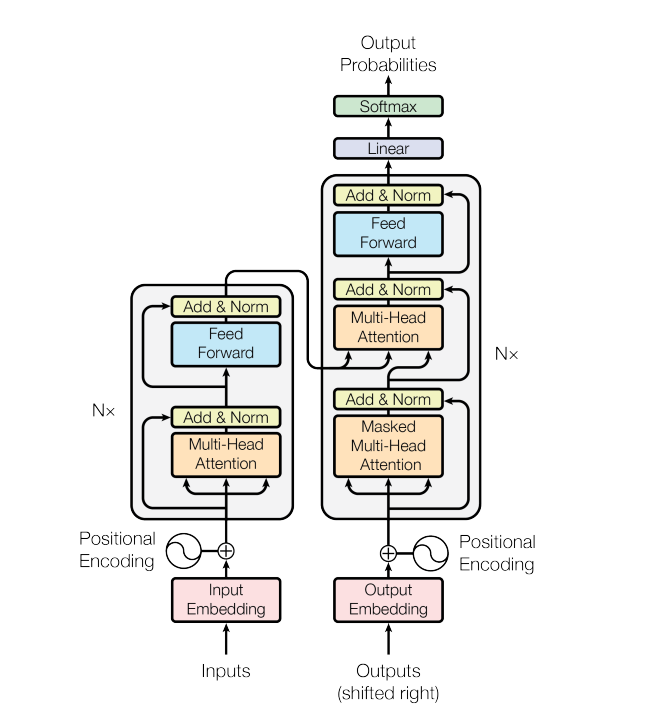

# LLM

## Transformer model

### Input Embeddings

The first step is feeding out input into a word embedding layer. A word embedding layer can be thought of as a lookup table to grab a learned vector representation of each word. Neural networks learn through numbers so each word maps to a vector with continuous values to represent that word.

### Positional Encoding

The next step is to inject positional information into the embeddings. Because the transformer encoder has no recurrence like recurrent neural networks, we must add some information about the positions into the input embeddings. This is done using positional encoding. The authors came up with a clever trick using sin and cosine functions.

### Multi-Head Attention

Multi-headed attention in the encoder applies a specific attention mechanism called **self-attention**. Self-attention allows the models to associate each word in the input, to other words. So in our example, it’s possible that our model can learn to associate the word “you”, with “how” and “are”. It’s also possible that the model learns that words structured in this pattern are typically a question so respond appropriately.

### **Query, Key, and Value Vectors**

To achieve self-attention, we feed the input into 3 distinct fully connected layers to create the query, key, and value vectors.

The query key and value concept come from retrieval systems. For example, when you type a query to search for some video on Youtube, the search engine will map your **query** against a set of **keys** (video title, description etc.) associated with candidate videos in the database, then present you the best matched videos (**values**).

The score matrix determines how much focus should a word be put on other words. So each word will have a score that corresponds to other words in the time-step. The higher the score the more focus. This is how the queries are mapped to the keys.

### Applying Softmax to the Adjusted Scores

Subsequently, a softmax function is applied to the adjusted scores to obtain the attention weights. This results in probability values ranging from 0 to 1. The softmax function emphasizes higher scores while diminishing lower scores, thereby enhancing the model's ability to effectively determine which words should receive more attention.

### Feed-Forward Neural Network

The journey of the normalized residual output continues as it navigates through a pointwise feed-forward network, a crucial phase for additional refinement.

Picture this network as a duo of linear layers, with a ReLU activation nestled in between them, acting as a bridge. Once processed, the output embarks on a familiar path: it loops back and merges with the input of the pointwise feed-forward network.

This reunion is followed by another round of normalization, ensuring everything is well-adjusted and in sync for the next steps.

### Output of the Encoder

The output of the final encoder layer is a set of vectors, each representing the input sequence with a rich contextual understanding. This output is then used as the input for the decoder in a Transformer model.

This careful encoding paves the way for the decoder, guiding it to pay attention to the right words in the input when it's time to decode.

Think of it like building a tower, where you can stack up N encoder layers. Each layer in this stack gets a chance to explore and learn different facets of attention, much like layers of knowledge. This not only diversifies the understanding but could significantly amplify the predictive capabilities of the transformer network.

### The Decoder WorkFlow

The decoder's role centers on crafting text sequences. Mirroring the encoder, the decoder is equipped with a similar set of sub-layers. It boasts two multi-headed attention layers, a pointwise feed-forward layer, and incorporates both residual connections and layer normalization after each sub-layer.

### Output Embeddings

At the decoder's starting line, the process mirrors that of the encoder. Here, the input first passes through an embedding layer

### Positional Encoding

Following the embedding, again just like the decoder, the input passes by the positional encoding layer. This sequence is designed to produce positional embeddings.

These positional embeddings are then channeled into the first multi-head attention layer of the decoder, where the attention scores specific to the decoder’s input are meticulously computed.

### Masked Self-Attention Mechanism

This is similar to the self-attention mechanism in the encoder but with a crucial difference: it prevents positions from attending to subsequent positions, which means that each word in the sequence isn't influenced by future tokens.

For instance, when the attention scores for the word "are" are being computed, it's important that "are" doesn't get a peek at "you", which is a subsequent word in the sequence.

This masking ensures that the predictions for a particular position can only depend on known outputs at positions before it.

### Encoder-Decoder Multi-Head Attention or Cross Attention

In the second multi-headed attention layer of the decoder, we see a unique interplay between the encoder and decoder's components. Here, the outputs from the encoder take on the roles of both queries and keys, while the outputs from the first multi-headed attention layer of the decoder serve as values.

### Feed-Forward Neural Network

Similar to the encoder, each decoder layer includes a fully connected feed-forward network, applied to each position separately and identically.

### Linear Classifier and Softmax for Generating Output Probabilities

The journey of data through the transformer model culminates in its passage through a final linear layer, which functions as a classifier.

The size of this classifier corresponds to the total number of classes involved (number of words contained in the vocabulary). For instance, in a scenario with 1000 distinct classes representing 1000 different words, the classifier's output will be an array with 1000 elements.

This output is then introduced to a softmax layer, which transforms it into a range of probability scores, each lying between 0 and 1. The highest of these probability scores is key, its corresponding index directly points to the word that the model predicts as the next in the sequence

## **Evaluation of LLM**

Some of the specific evaluation techniques for Large Language Models are

### Context specific evaluation:

- Relevance - How responses are pertinent to the questions or request
- Hallucination - Model generates factually incorrect or illogical response

QnA accuracy & Toxicity measures

The metrics for language model evaluation used are

### BLEU

**Bleu Score** (Bilingual Evaluation Understudy) - How machine generated text compares with human generated text in translation tasks.

### ROUGE

**Rouge Score** (Recall-Oriented Understudy for Gisting Evaluation) - set of metrics for automatic summarization and translation. It focuses on recalling how much reference content is captured in generated summary or translation.

### Perplexity

**Perplexity** - measure of how the model is confused or confident in generating the word using contextual understanding and meaning.

## Knowledge distillation

Knowledge distillation is **a machine learning technique that aims to transfer the learnings of a large pre-trained model, the “teacher model,” to a smaller “student model.”** It's used in deep learning as a form of model compression and knowledge transfer, particularly for massive deep neural networks.

## Quantization

Quantization is a model compression technique that converts the weights and activations within an LLM from a high-precision data representation to a lower-precision data representation, i.e., from a data type that can hold more information to one that holds less. A typical example of this is the conversion of data from a 32-bit floating-point number (FP32) to an 8-bit or 4-bit integer (INT4 or INT8). 

## Adversarial attack/training

Adversarial attacks are inputs that trigger the model to output something undesired. Much early literature focused on classification tasks, while recent effort starts to investigate more into outputs of generative models. In the context of large language models In this post we assume the attacks only happen **at inference time**, meaning that **model weights are fixed**.

The most common way to mitigate risks of adversarial attacks is to train the model on those attack samples, known as **adversarial training**. It is considered as the strongest defense but leading to tradeoff between robustness and model performance.

## Variatonal Autoencoder

Variational Autoencoders (VAEs) are generative models in machine learning (ML) that create new data similar to the input they are trained on. Along with data generation they also perform common autoencoder tasks like **denoising.** Like all autoencoders VAEs consist of:

- **Encoder:** Learns important patterns (latent variables) from input data.
- **Decoder:** It uses those latent variables to reconstruct the input.