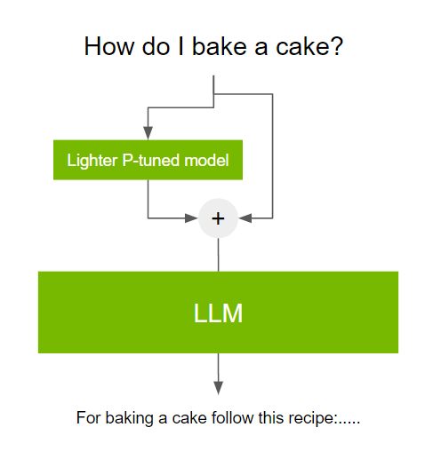

# LLM Tuning / Prompt engineering

## Prompt Engineering

### Few-shot

A Few-shot example is giving a few examples of the question and answers.

- Prompt: "Translate the following English sentences to French:
- 'Good morning' - 'Bonjour'
- 'Thank you' - 'Merci'
- 'See you soon' - 'À bientôt' Now, translate: 'Goodbye’”
- LLM Response: "Au revoir"

### Zero-shot

A Zero-shot example isn’t giving any examples for the LLM

- Prompt: "Translate the following English sentence to French: 'Hello, how are you?’”
- LLM Réponse: "Bonjour, comment ça va?"

### Chain-of-thought

Chain of thought prompting enables complex reasoning capabilities through intermediate reasoning steps

- Prompt: "Solve the math problem: 12 + 24. First, add the tens place: 10 + 20 = 30. Now, add

the ones place: 2 + 4 = 6. Finally, add the results: 30 + 6."

- LLM Response: "The answer is 36."

## Prompt Tuning

*prompt tuning*, ****is a parameter-efficient tuning technique that solves this challenge**. prompt** tuning involves using a small trainable model before using the LLM. The small model is used to encode the text prompt and generate task-specific virtual tokens.

These virtual tokens are pre-appended to the prompt and passed to the LLM. When the tuning process is complete, these virtual tokens are stored in a lookup table and used during inference, replacing the smaller model.

## Fine-Tuning

[**Fine-tuning**](https://www.geeksforgeeks.org/transfer-learning-with-fine-tuning-in-nlp/) refers to the process of taking a pre-trained model and adapting it to a specific task by training it further on a smaller, domain-specific dataset. Fine tuning is a form of transfer learning that refines the model’s capabilities, improving its accuracy in specialized tasks without needing a massive dataset or expensive computational resources.

Fine-tuning allows us to:

- **Steer the model** towards performing optimally on particular tasks.
- **Ensure model outputs** align with expected results for real-world applications.
- **Reduce model hallucinations** and improve output relevance and honesty.

### PEFT

Parameter-Efficient Fine-Tuning (PEFT) methods enable efficient adaptation of large pretrained models to various downstream applications by only fine-tuning a small number of (extra) model parameters instead of all the model's parameters. This significantly decreases the computational and storage costs. Recent state-of-the-art PEFT techniques achieve performance comparable to fully fine-tuned models.

### LoRA

Low-rank adaptation (LoRA) is a technique for quickly adapting [machine learning](https://www.cloudflare.com/learning/ai/what-is-machine-learning/) models to new contexts. LoRA helps make huge and complicated machine learning models much more suited for specific uses. It works by adding lightweight pieces to the original model, as opposed to changing the entire model. LoRA helps developers quickly expand the use cases for the machine learning models they build.

### P-tuning

Prefix tuning is a **parameter-efficient finetuning method for large-scale pretrained language models**. It is an additive method where only a sequence of continuous task-specific vectors is attached to the beginning of the input, or prefix. Only the prefix parameters are optimized and added to the hidden states in every layer of the model.

## Fine-Tuning vs Prompt Tuning vs Prompt Engineering

| **Aspect** | **Fine-Tuning** | **Prompt Tuning** | **Prompt Engineering** |
| --- | --- | --- | --- |
| **Definition** | Adjusting model weights on a specific task or dataset. | Modifying the prompt or small parameters for better output. | Crafting input prompts for desired model behavior. |
| **Level of Model Change** | Model weights change. | No change to model weights, small adjustments to input. | No change to model or weights. |
| **Cost** | High (computational resources, data needed). | Low (lighter adjustments, fewer resources). | Very low (mainly requires creativity and understanding). |
| **Flexibility** | Highly flexible, but resource intensive. | Less flexible than fine-tuning but easier to implement. | Flexible, as it depends on the creativity of the user. |
| **Use Cases** | Specialized domains, highly specific tasks. | Tasks needing slight model behavior adjustments. | General-purpose use, creative tasks, and task-specific queries. |
| **Pros** | High accuracy for specific tasks. | Less resource-intensive, fast to adjust. | Quick to implement, cost-effective, and flexible. |
| **Cons** | Requires computational power and time. | Limited control over model behavior. | Requires expertise to craft effective prompts. |