# Machine Learning

## Regression and Classification

**Regression** - is a supervised algorithm used to analyze the relationship between a dependent variable (target variable) and one or more independent variables (predictor variables). The objective is to determine the most suitable function that characterizes the connection between these variables.

**Classification** - is a supervised machine learning method where the model tries to predict the correct label of a given input data.

**Logistic regression -** is a **supervised machine learning algorithm** used for **classification tasks** where the goal is to predict the probability that an instance belongs to a given class or not. Logistic regression is a statistical algorithm which analyze the relationship between two data factors.

Logistic regression is used for binary [classification](https://www.geeksforgeeks.org/getting-started-with-classification/) where we use [sigmoid function](https://www.geeksforgeeks.org/derivative-of-the-sigmoid-function/), that takes input as independent variables and produces a probability value between 0 and 1.

For example, we have two classes Class 0 and Class 1 
if the value of the logistic function for an input is greater than 0.5 
(threshold value) then it belongs to Class 1 otherwise it belongs to 
Class 0. It’s referred to as regression because it is the extension of [linear regression](https://www.geeksforgeeks.org/ml-linear-regression/) but is mainly used for classification problems.

### One Hot Encoding

**One Hot Encoding** is a method for converting categorical variables into a binary format. It creates new binary columns (0s and 1s) for each category in the original variable. Each category in the original column is represented as a separate column, where a value of 1 indicates the presence of that category, and 0 indicates its absence.

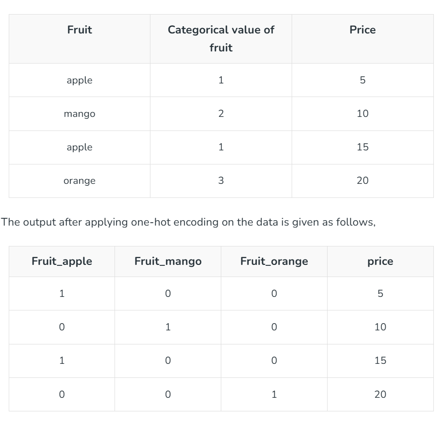

### Metrics for Regression model

- Mean Absolute Error (MAE)

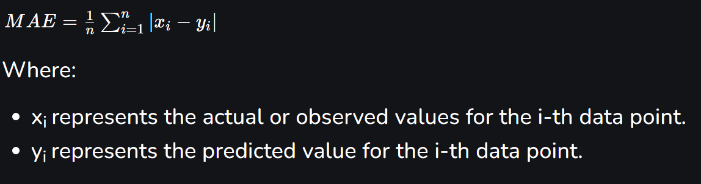

- Mean Squared Error (MSE)

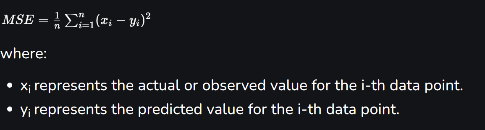

- R-squared (R²) Score

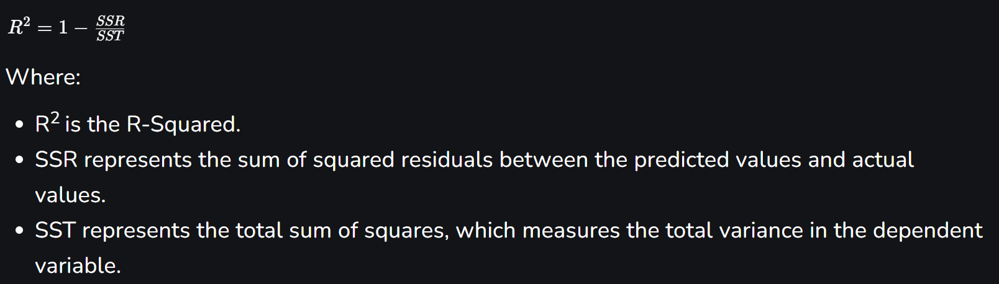

- Root Mean Squared Error (RMSE)

### Metrics for classification model

- Precision

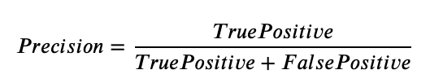

- Recall (Sensitivity)

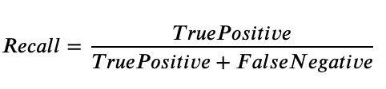

- F1 Score

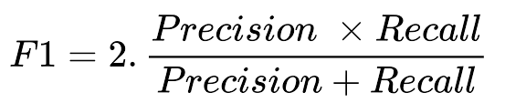

- AUC-ROC 
The AUC-ROC curve, or Area Under the Receiver Operating Characteristic curve, is a graphical representation of the performance of a binary classification model at various classification thresholds. It is commonly used in machine learning to assess the ability of a model to distinguish between two classes, typically the positive class (e.g., presence of a disease) and the negative class (e.g., absence of a disease).

Red graph is better than the blue one 

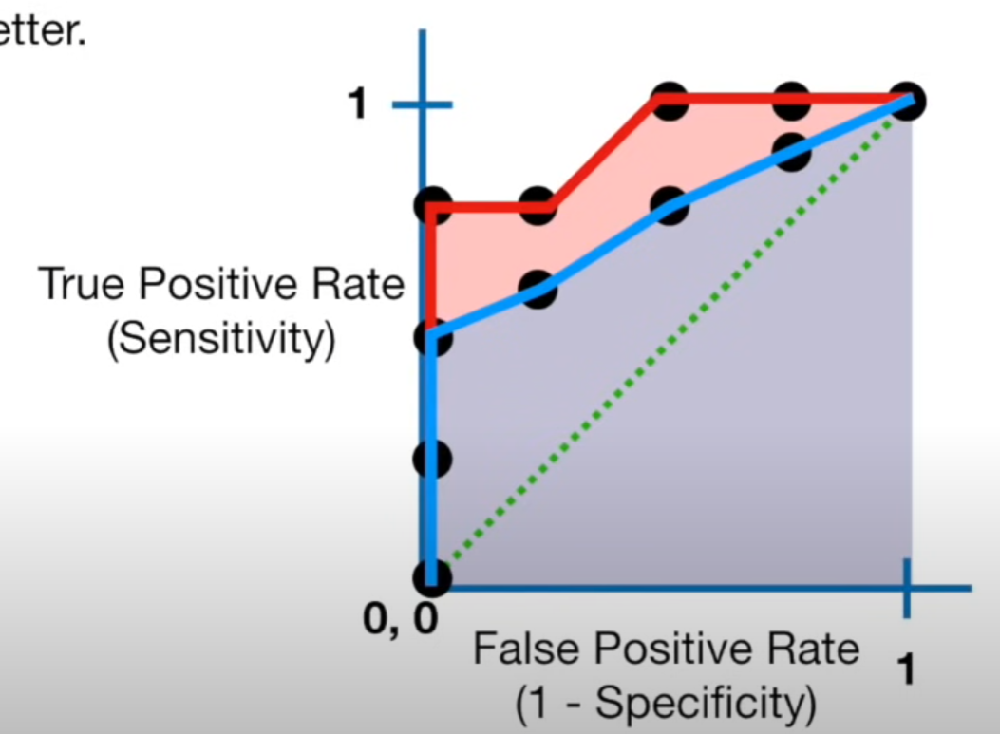

- Log Loss (Cross-Entropy)

Logarithmic Loss, commonly known as Log Loss or Cross-Entropy Loss, is a crucial metric in machine learning, particularly in classification problems. It quantifies the performance of a classification model by measuring the difference between predicted probabilities and actual outcomes. For any given problem, a lower log-loss value means better predictions.

## Overfitting and bias

**Overfitting** is an undesirable machine learning behavior that occurs when the machine learning model gives accurate predictions for training data but not for new data.

**Bias** is simply defined as the inability of the model because of that there is some difference or error occurring between the model’s predicted value and the actual value.

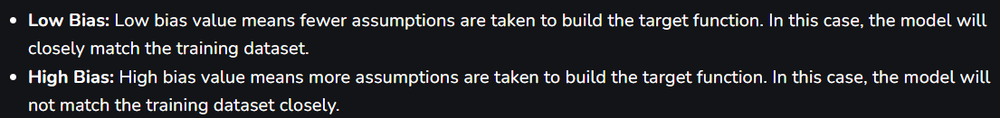

## Regularization

Regularization is a technique used to reduce errors by fitting the function appropriately on the given training set and avoiding overfitting. The commonly used [**regularization techniques**](https://www.geeksforgeeks.org/lasso-vs-ridge-vs-elastic-net-ml/) are :

1. Lasso Regularization – L1 Regularization
    
    A regression model which uses the **L1 Regularization** technique is called **LASSO(Least Absolute Shrinkage and Selection Operator)** regression. **Lasso Regression** adds the *“absolute value of magnitude”* of the coefficient as a penalty term to the loss function(L). Lasso regression also helps us achieve feature selection by penalizing the weights to approximately equal to zero if that feature does not serve any purpose in the model.
    
2. Ridge Regularization – L2 Regularization
    
    A regression model that uses the **L2 regularization** technique is called **Ridge regression**. **Ridge regression** adds the “*squared magnitude*” of the coefficient as a penalty term to the loss function(L).
    
3. Elastic Net Regularization – L1 and L2 Regularization
    
    This model is a combination of L1 as well as L2 regularization. That implies that we add the absolute norm of the weights as well as the squared measure of the weights. With the help of an extra hyperparameter that controls the ratio of the L1 and L2 regularization
    

## Benefits of Regularization

1. Regularization improves model generalization by reducing overfitting. Regularized models learn underlying patterns, while overfit models memorize noise in training data.
2. Regularization techniques such as L1 (Lasso) L1 regularization simplifies models and improves interpretability by reducing coefficients of less important features to zero.
3. Regularization improves model performance by preventing excessive weighting of outliers or irrelevant features.

## **k-fold Cross-Validation**

K-Fold Cross-Validation splits the dataset into K subsets or "folds," where each fold is used as a validation set while the remaining folds are used as training sets. This helps in understanding how the model performs across different subsets of the data and avoids overfitting.

## KNN Algorithm

**K-Nearest Neighbors (KNN) algorithm** is a supervised machine learning method employed to tackle classification and regression problems. It is widely disposable in real-life scenarios since it is non-parametric, meaning it does not make any underlying assumptions about the distribution of data (as opposed to other algorithms such as GMM, which assume a Gaussian distribution of the given data).

Distance is measured by:

- Euclidean distance

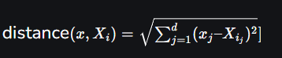

- Manhattan Distance
    
    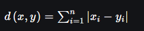
    

## SVM Algorithm

**Support Vector Machine (SVM)** is a powerful **machine learning algorithm** widely used for both **linear and nonlinear classification**, as well as **regression** and **outlier detection** tasks.  

SVMs are particularly effective because they focus on finding the **maximum separating hyperplane** between the different classes in the target feature, making them robust for both **binary and multiclass classification**

The primary objective of the **SVM algorithm** is to identify the **optimal hyperplane** in an N-dimensional space that can effectively separate data points into different classes in the feature space. The algorithm ensures that the margin between the closest points of different classes, known as **support vectors**, is maximized.

- **Linear Classification:** Linear classification is a straightforward approach where a linear hyperplane is used to separate classes. This method is often preferred due to its simplicity and ease of interpretation. Linear classifiers can be visualized as lines in two-dimensional space or hyperplanes in higher dimensions. The decision boundary is defined by a set of parameters that determine the orientation and position of the hyperplane.
- **Non-linear Classification**: Non-linear classification, on the other hand, involves using more complex boundaries to separate classes. This approach is necessary when the classes are not linearly separable, meaning that a linear hyperplane cannot accurately distinguish between them. Non-linear classifiers can capture intricate patterns and relationships in the data, making them more powerful than linear classifiers. However, they can also be more computationally intensive and prone to overfitting.

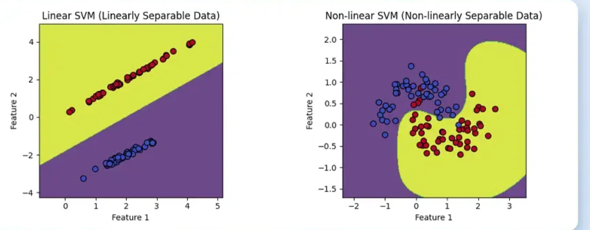

### Hyperplane and margin

A line that is used to **classify one class from another** is called a hyperplane. Hyperplanes are **decision boundaries** that help classify the data points.
Our objective is to **find a plane that has the maximum margin**, i.e the maximum distance between data points of both classes. Maximizing the margin distance **provides some reinforcement so that future data points can be classified with more confidence**.

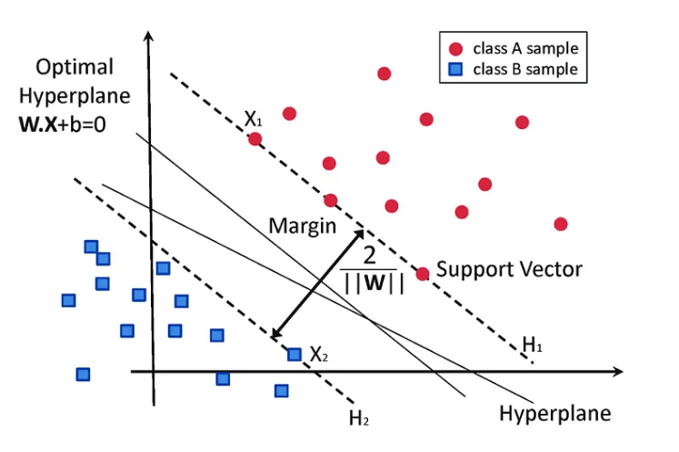

### Kernel Function

**Kernel** Function is a method used to take data as input and transform it into the required form of processing data. “Kernel” is used due to a set of mathematical functions used in Support Vector Machine providing the window to manipulate the data. So, Kernel Function generally transforms the training set of data so that a non-linear decision surface is able to transform to a linear equation in a higher number of dimension spaces.

Kernel functions:

- Gaussian Kernel ****It is used to perform transformation when there is no prior knowledge about data.

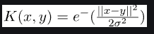

- **Gaussian Kernel Radial Basis Function (RBF):** Same as above kernel function, adding radial basis method to improve the transformation.
- **Sigmoid Kernel:** this function is equivalent to a two-layer, perceptron model of the neural network, which is used as an activation function for artificial neurons.

### Hard margin

In a **hard margin** SVM, the objective is to identify a hyperplane that completely separates data points belonging to different classes, ensuring a clear demarcation with the utmost margin width possible. This margin is the distance between the hyperplane and the nearest data point, also known as the support vectors.

Adventages of hard margin SVM:

- **Guaranteed Separation:** Hard margin SVM ensures that the classes are perfectly separated, leading to optimal generalization performance when the training data is linearly separable.
- **Simplicity:** The optimization problem in hard margin SVM is well-defined and has a unique solution, making it computationally efficient.

Disadvantages of Hard Margin

- **Sensitivity to Outliers**: Hard margin SVM is highly sensitive to outliers or noisy data points. Even a single mislabeled point can significantly affect the position of the decision boundary and lead to poor generalization on unseen data.
- **Not Suitable for Non-linear Data**: When the data is not linearly separable, hard margin SVM fails to find a valid solution, rendering it impractical for many real-world datasets.

### Soft margin

**Soft Margin SVM** introduces flexibility by allowing some margin violations (misclassifications) to handle cases where the data is not perfectly separable. Suitable for scenarios where the data may contain noise or outliers. It Introduces a penalty term for misclassifications, allowing for a trade-off between a wider margin and a few misclassifications.

Advantages of Soft Margin SVM

- **Robustness to Outliers:** Soft margin SVM can handle outliers or noisy data more effectively by allowing for some misclassifications. This results in a more robust decision boundary that generalizes better to unseen data.
- **Applicability to Non-linear Data**: Unlike hard margin SVM, soft margin SVM can handle non-linearly separable data by implicitly mapping it to a higher-dimensional space using kernel functions. This enables SVM to capture complex decision boundaries.

Disadvantages of Soft Margin SVM

- **Need for Parameter Tuning**: The performance of soft margin SVM heavily depends on the choice of the regularization parameter C. Selecting an appropriate value for C requires careful tuning, which can be time-consuming and computationally expensive, especially for large datasets.
- **Potential Overfitting**: In cases where the value of C is too large, soft margin SVM may overfit the training data by allowing too many margin violations.

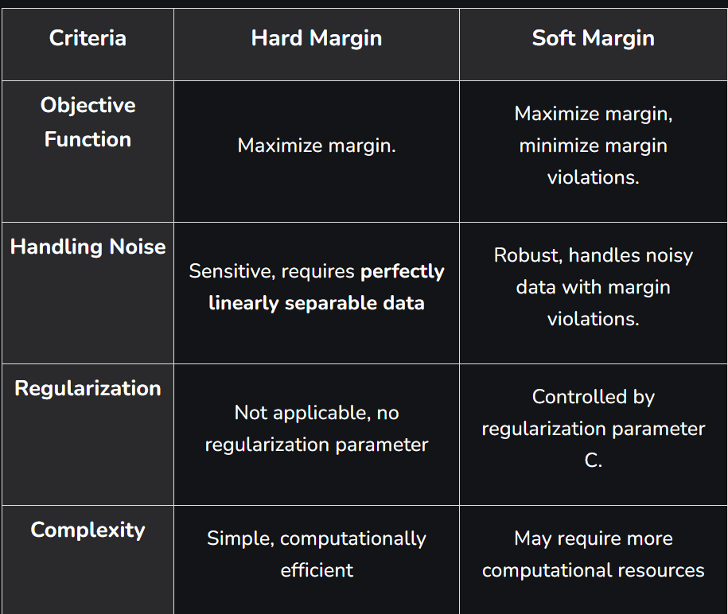

## Ensemble Learning

Ensemble learning is a machine learning technique that aggregates two or more learners (e.g. regression models, neural networks) in order to produce better predictions. In other words, an ensemble model combines several individual models to produce more accurate predictions than a single model alone.

### Bagging

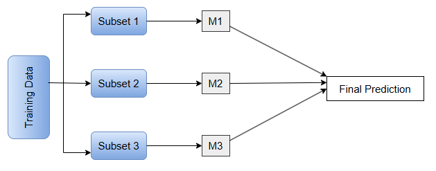

Bagging is a homogenous parallel method sometimes called bootstrap aggregating. It uses modified replicates of a given training data set to train multiple base learners with the same training algorithm.12 Scikit-learn’s ensemble module in Python contains functions for implementing bagging, such as BaggingClassifier. The final prediction is made by aggregating the predictions of all base model using **majority voting**. In the models of regression the final prediction is made by **averaging the predictions** of the all base model and that is known as bagging regression

### Boosting

Boosting is an ensemble modeling technique designed to create a strong classifier by combining multiple weak classifiers. The process involves building models sequentially, where each new model aims to correct the errors made by the previous ones.

**XGBoost**, which stands for Extreme Gradient Boosting, is a scalable, distributed gradient-boosted decision tree (GBDT) machine learning library. It provides parallel tree boosting and is the leading machine learning library for regression, classification, and ranking problems.

**AdaBoost** (Adaptive Boosting) is a very popular boosting technique that aims at combining multiple weak classifiers to build one strong classifier.

**Differences Between Bagging and Boosting**

## Reinforcement learning

**Reinforcement Learning (RL)** is a branch of machine learning that focuses on how agents can learn to make decisions through trial and error to maximize cumulative rewards. RL allows machines to learn by interacting with an environment and receiving feedback based on their actions. This feedback comes in the form of **rewards or penalties**.

## Decision Trees (classification and regression models)

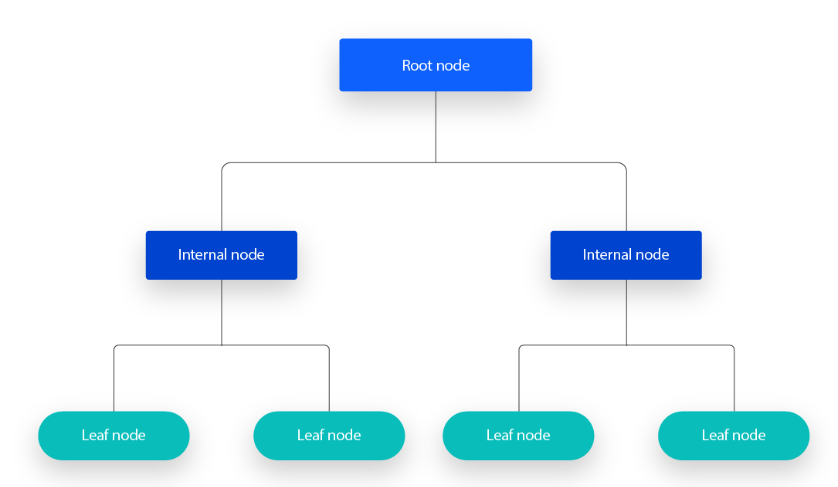

A decision tree is a non-parametric supervised learning algorithm, which is utilized for both classification and regression tasks. It has a hierarchical, tree structure, which consists of a root node, branches, internal nodes and leaf nodes.

### Random Forest

It works by creating a number of Decision Trees during the training phase. Each tree is constructed using a random subset of the data set to measure a random subset of features in each partition. This randomness introduces variability among individual trees, reducing the risk of overfitting and improving overall prediction performance. In prediction, the algorithm aggregates the results of all trees, either by voting (for classification tasks) or by averaging (for regression tasks)

### Gini impurity

Gini impurity **measures how often a randomly chosen element of a set would be incorrectly labeled if it were labeled randomly and independently according to the distribution of labels in the set**. It reaches its minimum (zero) when all cases in the node fall into a single target category.

## Clustering

**Clustering** is **an unsupervised machine learning technique designed to group unlabeled examples based on their similarity to each other**.

### Kmeans

**K-means** is an iterative, centroid-based clustering algorithm that partitions a dataset into similar groups based on the distance between their centroids. The centroid, or cluster center, is either the mean or median of all the points within the cluster depending on the characteristics of the data.

The goal of the k-means clustering algorithm is to minimize the sum of squared errors (SSE).2 Computing the SSE of the squared euclidean distance of each point to its closest 
centroid evaluates the quality of the cluster assignments by measuring the total variation within each cluster.

**Elbow Method**

The Elbow Method is a visual approach used to determine the ideal ‘K’ (number of clusters) in K-means clustering. It operates by calculating the Within-Cluster Sum of Squares (WCSS), which is the total of the squared distances between data points and their cluster center. However, there is a point where increasing K no longer leads to a significant decrease in WCSS, and the rate of decrease slows down. This point is often referred to as the **elbow**.

### DBScan

Density-based spatial clustering of applications with noise (DBSCAN) is a clustering algorithm used in machine learning to partition data into clusters based on their distance to other points. Its effective at identifying and removing noise in a data set, making it useful for data cleaning and outlier detection. 

### Silhouette score

The **Silhouette Score** is a metric used to evaluate the quality of clusters in a clustering algorithm. It measures how similar a sample is to its own cluster compared to other clusters. The score ranges from -1 to 1, where a higher score indicates better-defined clusters.

### Gaussian mixture model

A Gaussian mixture model is a soft clustering technique used in unsupervised learning to determine the probability that a given data point belongs to a cluster. It’s composed of several Gaussians, each 
identified by *k* ∈ {1,…, *K*}, where *K* is the number of clusters in a data set.

## Federated learning

Federated learning (also known as collaborative learning) is a machine learning technique in a setting where multiple entities (often called clients) collaboratively train a model while keeping their data decentralized, rather than centrally stored. A defining characteristic of federated learning is data heterogeneity.

## SMOTE

SMOTE stands for Synthetic Minority Oversampling Technique. It’s a technique used in machine learning to address imbalanced datasets.

1. **Identify the Imbalance:** You start by recognizing that your data has a minority class, like rare disease cases in a medical dataset.
2. **Focus on the minority:** SMOTE specifically creates new data points for the minority class, not the majority.
3. **Create synthetic samples:** It analyzes existing minority data points and generates new ones similar to them.
4. **Increase minority:** By adding these synthetic samples, SMOTE balances the data, giving the model a better chance to learn the minority class.

## Feature selection

In real-world machine learning tasks not all features in the dataset contribute equally to model performance. Some features may be redundant, irrelevant or even noisy. Feature selection helps remove these improving the model’s accuracy instead of random guessing based on all features and increased interpretability.

There are various algorithms used for feature selection and are grouped into three main categories:

1. **Filter Methods**
2. **Wrapper Methods**
3. **Embedded Methods**

### Filter Methods

Filter methods evaluate each feature independently with target variable. Feature with high correlation with target variable are selected as it means this feature has some relation and can help us in making predictions. These methods are used in the preprocessing phase to remove irrelevant or redundant features based on statistical tests (correlation) or other criteria.

Some techniques used:

- **Fisher’s score**
- **Correlation Coefficient**
- **Variance Threshold**
- **Mean Absolute Difference (MAD)**
- **Dispersion Ratio**

### Wrapper Methods

Wrapper methods are also referred as greedy algorithms that train algorithm. **They use different combination of features and compute relation between these subset features and target variable and based on conclusion addition and removal of features are done.** Stopping criteria for selecting the best subset are usually pre-defined by the person training the model such as when the performance of the model decreases or a specific number of features are achieved.

Some techniques used are:

- **Forward selection**
- **Backward elimination**
- **Recursive elimination**

### **Embedded methods**

Embedded methods perform feature selection during the model training process. They combine the benefits of both filter and wrapper methods. Feature selection is integrated into the model training allowing the model to select the most relevant features based on the training process dynamically.

Some techniques used are:

- **L1 Regularization (Lasso)**
- **Decision Trees and Random Forests**
- **Gradient Boosting**

## Feature extraction

Transforms existing features into a new set of features that captures better underlying patterns in data. It is useful when raw data is in high dimension or complex. Techniques like PCA, LDA and Autoencoders are used for this purpose.

### PCA

Principal component analysis (PCA) is a dimensionality reduction and machine learning method used to simplify a large data set into a smaller set while maximizing the variance (or spread) of the data in the new space and still maintaining significant patterns and trends.

## Mixture of Experts

**Mixture of experts** (**MoE**) is a [machine learning](https://en.wikipedia.org/wiki/Machine_learning) technique where multiple expert [networks](https://en.wikipedia.org/wiki/Neural_network_(machine_learning)) (learners) are used to divide a problem space into homogeneous regions. MoE represents a form of [ensemble learning](https://en.wikipedia.org/wiki/Ensemble_learning).

MoEs:

- Are **pretrained much faster** vs. dense models
- Have **faster inference** compared to a model with the same number of parameters
- Require **high VRAM** as all experts are loaded in memory
- Face many **challenges in fine-tuning**

## Mixed Precision Training

Mixed precision methods combine the use of different numerical formats in one computational workload. [**Mixed precision**](https://arxiv.org/abs/1710.03740) training offers significant computational speedup by performing operations in half-precision format, while storing minimal information in single precision to retain as much information as possible in critical parts of the network.

## RLHF

Reinforcement learning from human feedback (RLHF) is a machine learning (ML) technique that uses human feedback to optimize ML models to self-learn more efficiently. Reinforcement learning (RL) techniques train software to make decisions that maximize rewards, making their outcomes more accurate. RLHF incorporates human feedback in the rewards function, so the ML model can perform tasks more aligned with human goals, wants, and needs. RLHF is used throughout generative artificial intelligence (generative AI) applications, including in large language models (LLM).