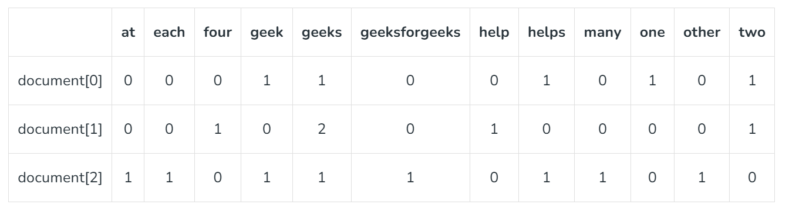

# Natural Language Processing (NLP)

### Tokenization

Tokenization is the process of breaking down a text into individual words or tokens. These tokens are the building blocks for further analysis.

### Stop words

Stop words are common words (e.g., “the,” “is,” “and”) that are often removed during NLP tasks as they don’t carry significant meaning.

### Stemming

Stemming involves reducing words to their root or base form. It aims to simplify words to their core, removing prefixes or suffixes. Major disadvantage of stemming is that some of the words which gets stemmized may not be a proper word like happy becomes happi, history becomes histori, congratulations becomes congratul etc.

### Lemmatization

Lemmatization is similar to stemming but more sophisticated. It involves reducing words to their base or dictionary form (lemma) to ensure a valid word.

`.lemmatize()` contains 2 arguments: first one is the word and second one is **pos (part of speech)** which means how should the word be treated like as a noun (n which is by default), verb (v), adjective (a), adverb (r)

### Out of vocabulary (OOV) handling

Out-of-Vocabulary (OOV) words refer to any words a machine learning model has not encountered during its training phase. These words are not part of the model’s predefined vocabulary, which poses a significant challenge when processing text or speech that includes them. Since these models rely heavily on their learned vocabulary to make sense of input, encountering an OOV word can lead to errors or inaccuracies.

One of the most widely adopted methods for dealing with OOV words is subword tokenization. Instead of treating words as atomic units, subword tokenization breaks them down into smaller pieces, such as prefixes, suffixes, or character n-grams. This allows models to build words from smaller, familiar components, making them more resilient to new or rare words.

Transformer-based models like BERT, GPT, and T5 have significantly advanced NLP’s ability to handle OOV words by leveraging deep contextual understanding. Unlike traditional models that rely on static word representations, transformers use context to interpret word meaning, even if a word is rare or unfamiliar.

### TF-IDF (Term Frequency-Inverse Document Frequency)

**TF-IDF** stands for Term Frequency Inverse Document Frequency of records. It can be defined as the calculation of how relevant a word in a series or corpus is to a text. The meaning increases proportionally to the number of times in the text a word appears but is compensated by the word frequency in the corpus (dataset).

**Terminologies:**

- **Term Frequency:** In document d, the frequency represents the number of instances of a given word t. Therefore, we can see that it becomes more relevant when a word appears in the text, which is rational. Since the ordering of terms is not significant, we can use a vector to describe the text in the bag of term models. For each specific term in the paper, there is an entry with the value being the term frequency.

The weight of a term that occurs in a document is simply proportional to the term frequency.

```
tf(t,d) = count of t in d / number of words in d
```

- **Document Frequency:** This tests the meaning of the text, which is very similar to TF, in the whole corpus collection. The only difference is that in document d, TF is the frequency counter for a term t, while df is the number of occurrences in the document set N of the term t. In other words, the number of papers in which the word is present is DF.

```
df(t) = occurrence of t in documents
```

- **Inverse Document Frequency:** Mainly, it tests how relevant the word is. The key aim of the search is to locate the appropriate records that fit the demand. Since tf considers all terms equally significant, it is therefore not only possible to use the term frequencies to measure the weight of the term in the paper. First, find the document frequency of a term t by counting the number of documents containing the term:

```
df(t) = N(t)
where
df(t) = Document frequency of a term t
N(t) = Number of documents containing the term t
```

Term frequency is the number of instances of a term in a single document only; although the frequency of the document is the number of separate documents in which the term appears, it depends on the entire corpus. Now let’s look at the definition of the frequency of the inverse paper. The IDF of the word is the number of documents in the corpus separated by the frequency of the text.

```
idf(t) = N/ df(t) = N/N(t)
```

The more common word is supposed to be considered less significant, but the element (most definite integers) seems too harsh. We then take the logarithm (with base 2) of the inverse frequency of the paper. So, the if of the term t becomes:

```
idf(t) = log(N/ df(t))
```

- **Computation:** Tf-idf is one of the best metrics to determine how significant a term is to a text in a series or a corpus. tf-idf is a weighting system that assigns a weight to each word in a document based on its term frequency (tf) and the reciprocal document frequency (tf) (idf). The words with higher scores of weights are deemed to be more significant.

Usually, the tf-idf weight consists of two terms-

1. **Normalized Term Frequency (tf)**
2. **Inverse Document Frequency (idf)**

```
tf-idf(t, d) = tf(t, d) * idf(t)
```

### Countvectorizer

It is used to transform a given text into a vector on the basis of the frequency (count) of each word that occurs in the entire text. This is helpful when we have multiple such texts, and we wish to convert each word in each text into vectors (for using in further text analysis). Let us consider a few sample texts from a document (each as a list element):

> document = [ “One Geek helps Two Geeks”, “Two Geeks help Four Geeks”, “Each Geek helps many other Geeks at GeeksforGeeks.”]
> 

CountVectorizer creates a matrix in which each unique word is represented by a column of the matrix, and each text sample from the document is a row in the matrix. The value of each cell is nothing but the count of the word in that particular text sample.  This can be visualized as follows –



### Word2Vec

Word2Vec is a widely used method in [**natural language processing (NLP)**](https://www.geeksforgeeks.org/natural-language-processing-nlp-tutorial/) that allows words to be represented as vectors in a continuous vector space. Word2Vec is an effort to map words to high-dimensional vectors to capture the semantic relationships between words, developed by researchers at Google. Words with similar meanings should have similar vector representations, according to the main principle of Word2Vec. Word2Vec utilizes two architectures:

- **CBOW (Continuous Bag of Words):** The CBOW model predicts the current word given context words within a specific window. The input layer contains the context words, and the output layer contains the current word. The hidden layer contains the dimensions we want to represent the current word present at the output layer.
- **Skip Gram:** Skip gram predicts the surrounding context words within specific window given current word. The input layer contains the current word, and the output layer contains the context words. The hidden layer contains the number of dimensions in which we want to represent current word present at the input layer.


### Wordnet

WordNet is a large electronic lexical database(or dictionary) for English that was first created in 1985 at Princeton University, that has been widely used in natural language processing (NLP) tasks. it can be used to find synonyms, antonyms, and other semantic relationships between words. 

### Named Entity Recognition (NER)

**Name-entity recognition (NER)** is also referred to as **entity identification**, **entity chunking,** and **entity extraction**. NER is the component of information extraction that aims to identify and categorize named entities within unstructured text. NER involves the identification of key information in the text and classification into a set of predefined categories. An entity is the thing that is consistently talked about or refer to in the text, such as person names, organizations, locations, time expressions, quantities, percentages and more predefined categories.

### Evaluation (GLUE)

GLUE, also known as General Language Understanding Evaluation, is an evaluation benchmark designed to measure the performance of language understanding models in a range of natural language processing (NLP) tasks.  GLUE consists of a collection of nine representative NLP tasks, including sentence classification, sentiment analysis, and question answering. Each task in the benchmark comes with a training set, a development set for fine-tuning the models, and an evaluation set for testing the performance of the models. Participants in the benchmark can submit their models and evaluate their performance on the GLUE leaderboard, which tracks the progress and advancements in language understanding.

### Byte-Pair Encoding

Byte-Pair Encoding (BPE) is a compression algorithm used in [**Natural Language Processing (NLP)**](https://www.geeksforgeeks.org/natural-language-processing-nlp-tutorial/) to represent large vocabulary with a small set of subword units. It was introduced by Sennrich et al. in 2016 and has been widely used in various NLP tasks such as machine translation, text classification, and text generation. The basic idea of BPE is to iteratively merge the most frequent pair of consecutive bytes or characters in a text corpus until a predefined vocabulary size is reached. The resulting subword units can be used to represent the original text in a more compact and efficient way.