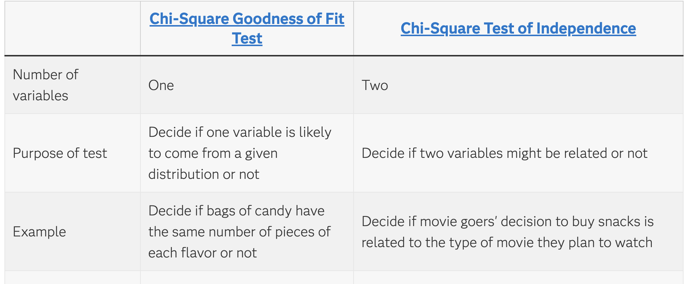

# Statistics

## Chi-Square test

You use a Chi-square test for hypothesis tests about whether your data is as expected. The basic idea behind the test is to compare the observed values in your data to the expected values that you would see if the **null hypothesis is true.**

There are two commonly used Chi-square tests: the [Chi-square goodness of fit test](https://www.jmp.com/en/statistics-knowledge-portal/chi-square-test/chi-square-goodness-of-fit-test) and the [Chi-square test of independence](https://www.jmp.com/en/statistics-knowledge-portal/chi-square-test/chi-square-test-of-independence).

## T-test

A t-test is an inferential statistic used to determine if there is a significant difference between the means of two groups and how they are related. T-tests are used when the data sets follow a normal distribution and have unknown variances, like the data set recorded from flipping a coin 100 times.

## Moving Average

Moving Average is a calculation to analyze data points by creating a series of [averages](https://en.wikipedia.org/wiki/Average) of different selections of the full data set. A moving average is commonly used with [time series](https://en.wikipedia.org/wiki/Time_series) data to smooth out short-term fluctuations and highlight longer-term trends or cycles - in this case the calculation is sometimes called a **time average**. The threshold between short-term and long-term depends on the application, and the parameters of the moving average will be set accordingly.

## PCA

**Principal Component Analysis (PCA)** is a statistical technique introduced by mathematician Karl Pearson in 1901. ***It works by transforming high-dimensional data into a lower-dimensional space while maximizing the variance (or spread) of the data in the new space***. This helps preserve the most important patterns and relationships in the data.

## t-SNE

t-SNE (t-distributed Stochastic Neighbor Embedding) is an unsupervised non-linear dimensionality reduction technique for data exploration and visualizing high-dimensional data. Non-linear dimensionality reduction means that the algorithm allows us to separate data that cannot be separated by a straight line.

| Characteristic | t-SNE | PCA |
| --- | --- | --- |
| Type | Non-linear dimensionality reduction | Linear dimensionality reduction |
| Goal | Preserve local pairwise similarities | Preserve global variance |
| Best used for | Visualizing complex, high-dimensional data | Data with linear structure |
| Output | Low-dimensional representation | Principal components |
| Use cases | Clustering, anomaly detection, NLP | Noise reduction, feature extraction |
| Computational intensity | High | Low |
| Interpretation | Harder to interpret | Easier to interpret |

## A/B testing

A/B testing is a statistical approach for comparing two or more versions/features to evaluate not only which one works better but also if the difference is statistically significant.

Using the A/B testing approach, **machine learning models may be evaluated and improved.** The approach may be used to see if a new model is better than one already exists. T**he organization should choose a metric to compare the control and new models for this purpose.** This metric is used to assess deployment success and differentiate between the two. Both models must be applied to a sample of data simultaneously for a predetermined period. Half of the users should use the control model, and the new model by the other half.

## Analyzing time series data (ARIMA)

An autoregressive integrated moving average, or ARIMA, is a statistical analysis model that uses [time series data](https://www.investopedia.com/terms/t/timeseries.asp) to either better understand the data set or to predict future trends.

A statistical model is autoregressive if it predicts future values based on past values. For example, an ARIMA model might seek to predict a stock's future prices based on its past performance or forecast a company's earnings based on past periods.

## Pearson’s Correlation Coefficient

Pearson Correlation is a statistical method that measures the similarity or correlation between two data objects by comparing their attributes and calculating a score ranging from -1 to +1. A high score indicates high similarity, while a score near zero indicates no correlation. This method is parametric and relies on the mean parameter of the objects, making it more valid for normally distributed data.

## ANOVA

ANOVA is a statistical method used to compare the means across three or more groups. It examines variability both within each group, and across them to determine statistical significance. Between-group variance comes from the differences between the group means while within-group variance comes from within each group, otherwise referred to as random noise.

The result of an ANOVA analysis will tell you if at least one of the group means is different from the others. Additional testing would be required to isolate which group, or groups, specifically deviate from the rest.

An ANOVA should be used when:

- You have one or more independent variables with three or more levels. If you only have two comparison levels total, a **t-test** would be used instead.
- Your dependent variable is continuous, allowing for means to be calculated within each group.
- The groups have equal variances, which can be tested as part of implementing an ANOVA.
- Each observation in your dataset is independent of the others.

## Dependent, Independent, Confounding and Controlled Variables

### Independent Variable

An independent variable is the variable the experimenter controls. Basically, it is the component you choose to change in an experiment. This variable is not dependent on any other variables. For instance, feature value in supervised learning 

### Dependent Variable

A dependent variable is the measurement that changes in response to what you changed in the experiment. This variable is dependent on other variables, hence the name. For instance, predicted value in supervised learning

### Controlled Variable

A control variable in science is any other parameter affecting your experiment that you try to keep the same across all conditions, for instance, learning rate. 

### Confounding Variable

Confounding variables are external factors that can influence both the independent and dependent variables in a study, potentially leading to incorrect conclusions.

## Hypothesis testing

Hypothesis method ***compares two opposite statements about a population and uses sample data to decide which one is more likely to be correct***. To test this assumption, we first take a sample from the population and analyze it and use the results of the analysis to decide if the claim is valid or not.

Suppose a company claims that its website gets an average of **50 user visits per day**. To verify this, we use hypothesis testing to analyze past website traffic data and determine if the claim is accurate. This helps us decide whether the observed data supports the company’s claim or if there is a significant difference.

### Null hypothesis

The null hypothesis (H0) is the starting assumption in statistics. It says there is no relationship between groups. For Example, ****A company claims its average production is 50 units per day then here: Null Hypothesis: H₀: The mean number of daily visits (*μ*) = 50.

### Alternative hypothesis

The alternative hypothesis (H1) is the opposite of the null hypothesis it suggests there is a difference between groups. **like t**he company’s production is not equal to 50 units per day then the alternative hypothesis would be: H₁: The mean number of daily visits (*μ*) ≠ 50.

### p-value

- A p-value is a statistical measurement used to validate a hypothesis against observed data.
- A p-value measures the probability of obtaining the observed results, assuming that the null hypothesis is true.
- The lower the p-value, the greater the statistical significance of the observed difference.
- A p-value of 0.05 or lower is generally considered statistically significant.
- P-value can serve as an alternative to—or in addition to—preselected confidence levels for hypothesis testing.

### Type I Error, Type II Error

- [**Type I error:**](https://www.geeksforgeeks.org/questions/hypothesis-testing-type-1-error-explained/) When we reject the null hypothesis although that hypothesis was true. Type I error is denoted by alpha(*α*).
- [**Type II errors](https://www.geeksforgeeks.org/type-ii-error-in-two-tailed-test-of-population-mean-with-known-variance-in-r/):** When we accept the null hypothesis but it is false. Type II errors are denoted by beta(*β*).

|  | **Null Hypothesis is True** | **Null Hypothesis is False** |
| --- | --- | --- |
| **Null Hypothesis is True (Accept)** | Correct Decision | Type II Error (False Negative) |
| **Alternative Hypothesis is True (Reject)** | Type I Error (False Positive) | Correct Decision |